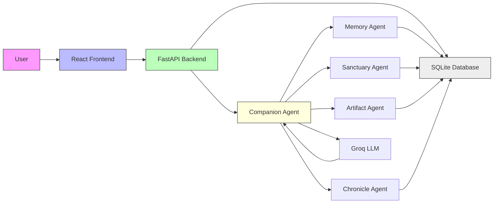
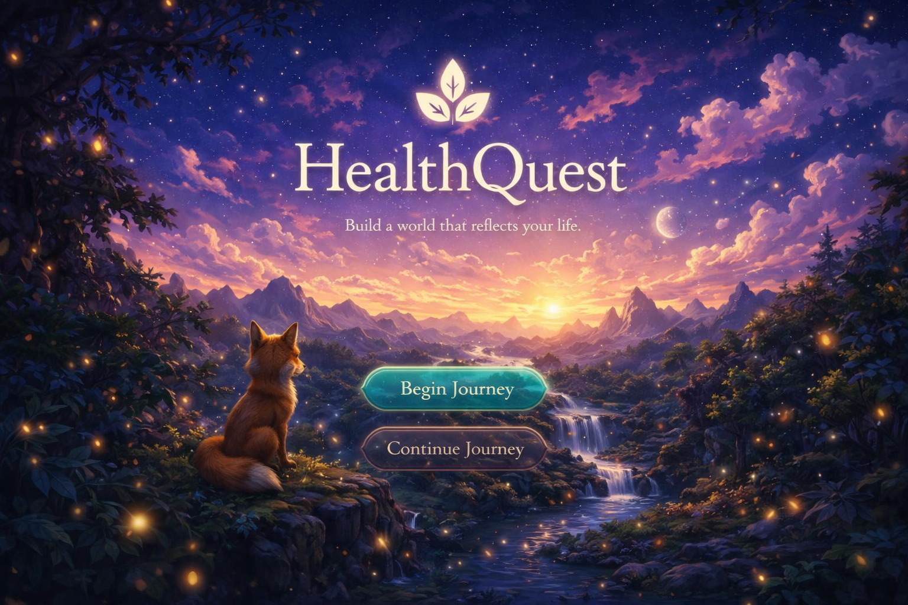
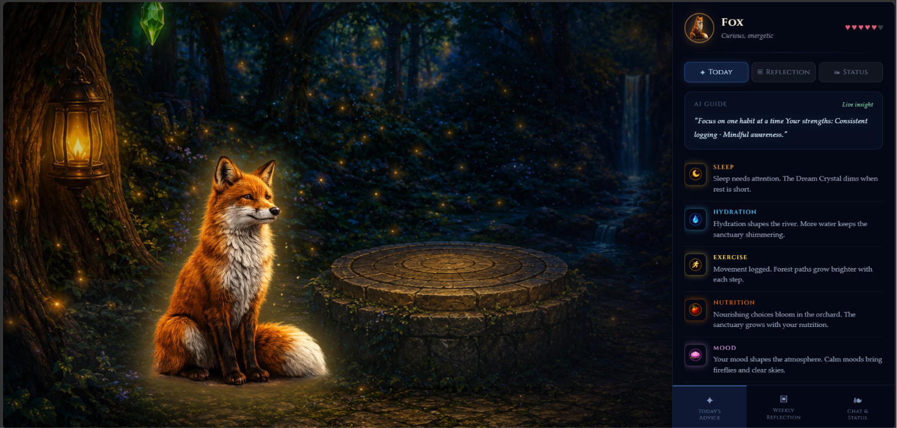
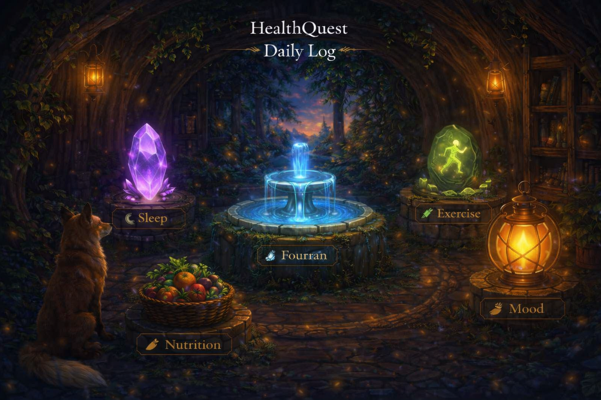
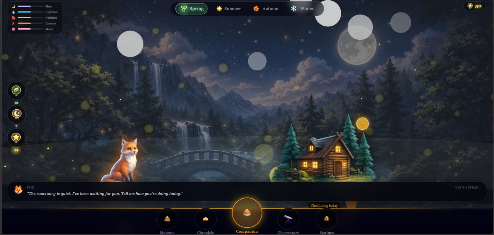
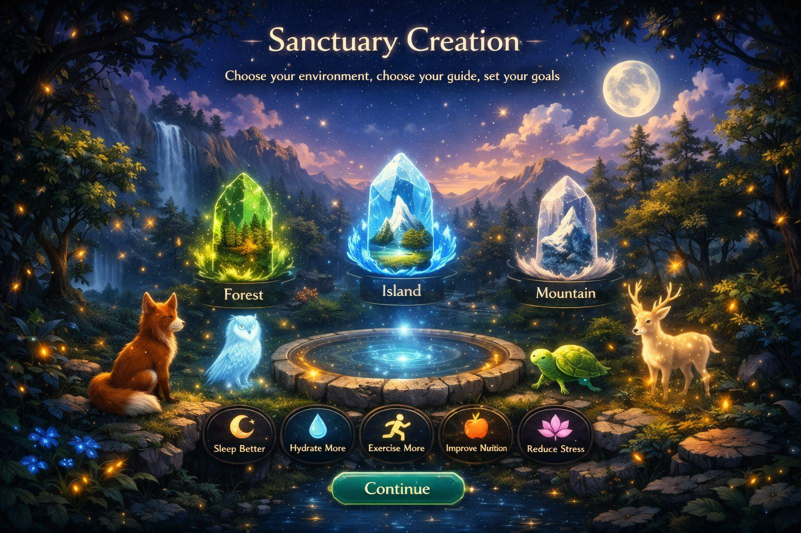
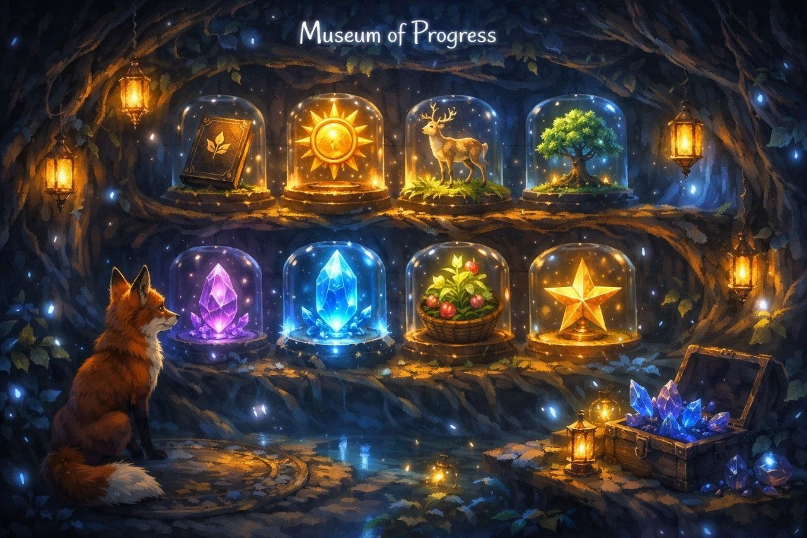
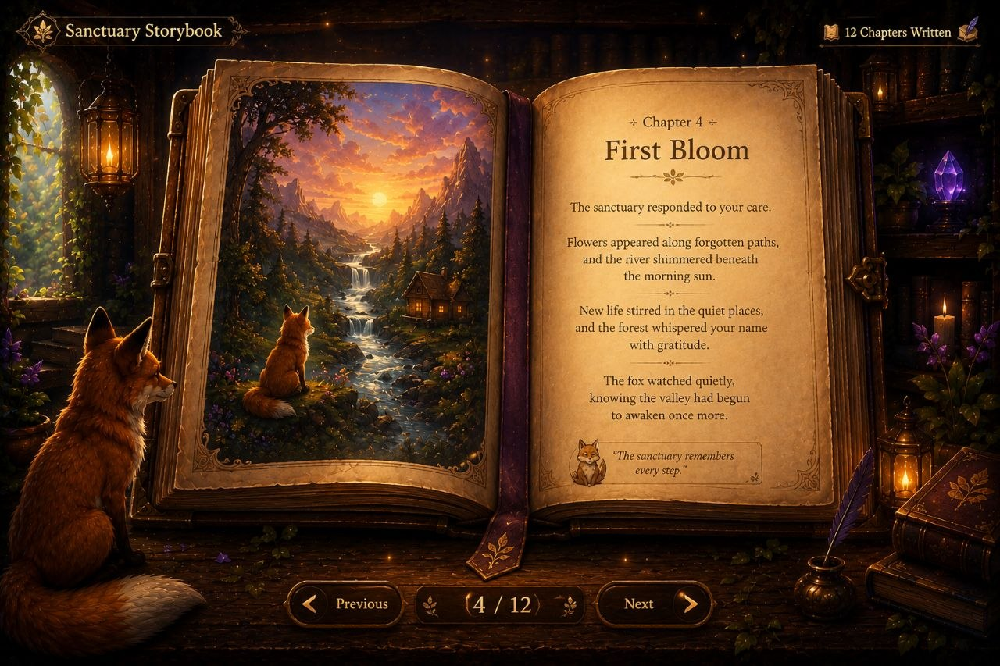

<!--- HealthQuest AI - Hackathon README (judge-grade) --->

# HealthQuest AI


---

## Hero Section

**HealthQuest AI** — Transforming wellness from tasks into a living journey.

- Tagline: An AI-powered wellness companion that turns habits into a living, evolving sanctuary.

- Problem: Wellness apps are transactional, numeric, and forgettable — users stop engaging.

- Solution: HealthQuest AI combines multi-agent AI reasoning, narrative-driven gamification, and persistent memory to convert small daily habits into meaningful story-driven progress.

- Key value proposition: Deep emotional engagement + personalized AI guidance + tangible, symbolic progress (sanctuary, artifacts, chronicles) that drives sustained behavior change.

---

## Overview

HealthQuest AI is an AI-powered wellness companion that transforms health habits into a living, evolving sanctuary. Users track their habits, grow a personalized sanctuary, unlock artifacts, build memories, generate chronicles, and interact with an intelligent fox companion that reasons about their progress and motivates change.

How users engage:

- Track habits: simple daily logging and progress capture.
- Grow a personalized sanctuary: each habit maps to symbolic elements (river, forest, sky, crystal) that evolve with behavior.
- Unlock artifacts: milestone achievements create museum artifacts with emotional context.
- Build memories: important events are stored and surfaced as personal memories.
- Generate chronicles: weekly narratives summarizing growth and insight.
- Interact with the fox companion: a context-aware AI companion that converses, reflects, and guides.

Why most wellness apps fail

Traditional apps focus on metrics, not meaning. They offer raw numbers, generic push notifications, and impersonal recommendations — which creates short-lived engagement. HealthQuest AI increases retention by embedding health goals in narrative, reward systems, and persistent memory that provides emotional continuity.

---

## Problem Statement

People abandon health and wellness apps because:

- They focus on numbers instead of meaning.
- They lack emotional engagement or storytelling.
- They provide generic, one-size-fits-all advice.
- They fail to create long-term motivation or contextual memory.

Market relevance and pain points:

- Rising demand for digital health solutions with measurable retention.
- Behavioral science shows storytelling and meaning dramatically improve habit formation.
- Users seek personalization, emotional resonance, and tangible progress markers.

---

## Solution

HealthQuest AI solves these problems through a combined product and AI approach:

- AI Companion: an LLM-based fox that reasons about context, intent, and progress.
- Sanctuary World: a living metaphor that visualizes health as an environment.
- Museum Artifacts: unlockable and collectible items that represent milestones.
- Chronicle System: automated weekly summaries and narrative reflections.
- Storybook Generation: AI-created chapters that turn progress into personal stories.
- Memory Engine: persistent storage of meaningful moments for contextual continuity.
- Reflection & Insights: analytical synthesis of trends and personalized recommendations.

---

## Key Features

### AI Companion

- Context-aware conversations that use short- and long-term memory.
- Intent recognition to route user messages to the appropriate agent.
- Personalized responses shaped by past milestones and current goals.
- Progress understanding: the companion interprets quantitative and qualitative signals.
- Sanctuary interpretation: translates user state into world transformations and narrative cues.

### Living Sanctuary

- Dynamic world state that changes with user behavior.
- River: flow and momentum for daily habits.
- Forest: growth and resilience representing long-term habits.
- Sky: mood and aspirational goals.
- Weather: short-term fluctuation signals (stress, rest, energy).
- Crystal: symbolic accumulators of deep, meaningful milestones.

### Museum of Achievements

- Unlockable artifacts that commemorate milestones and behavior shifts.
- Progress milestones are stored with context and narrative metadata.
- Meaningful rewards that encourage re-engagement and reflection.

### Chronicle

- Weekly journey summaries that synthesize actions, wins, setbacks, and trends.
- Narrative-focused summaries that are coachable and shareable.

### Storybook

- AI-generated narrative journeys shaped into personalized chapters.
- Shareable storybook exports for reflection or social sharing.

### Memory System

- Persistent memories that store important milestones, context, and meta-notes.
- Memory retrieval drives personalization and continuity across sessions.

### Reflection & Insights

- Health pattern recognition using aggregated signals.
- Personalized recommendations grounded in behavioral science.
- Trend analysis and visualizations surfaced in a reflection dashboard.

---

## AI Agent Architecture

> HealthQuest AI is built as a multi-agent system where specialized agents collaborate to deliver personalized, narratively-rich experiences.

### Companion Agent

Responsible for:

- Conversation management and dialog flow.
- Context understanding and grounding of user utterances.
- Determining intent and routing to specialized agents.

### Sanctuary Agent

Responsible for:

- Generating and maintaining the dynamic world state.
- Translating habit signals into environmental transformations.
- Managing symbolic elements (river, forest, sky, weather, crystal).

### Artifact Agent

Responsible for:

- Tracking unlockable artifacts and achievement progression.
- Creating and curating artifact metadata and narrative descriptions.

### Memory Agent

Responsible for:

- Persistent memory storage and indexing.
- Context retrieval for short- and long-term personalization.
- Memory pruning and relevance scoring.

### Chronicle Agent

Responsible for:

- Generating weekly summaries and narrative storytelling.
- Synthesizing progress trends, reflections, and next-step suggestions.

Agent collaboration

Agents collaborate through a lightweight orchestration layer: intent classification selects the primary agent(s), the Memory Agent surfaces relevant context, and specialized agents propose content/actions which the Companion Agent synthesizes and presents to the user. This modular design enables targeted reasoning, easier evaluation, and incremental improvements.

---

## How AI Works

Flow:

User Message
↓
Intent Classification
↓
Agent Selection
↓
Memory Retrieval
↓
Context Assembly
↓
LLM Reasoning (Groq + LLM pipelines)
↓
Companion Response

AI reasoning notes:

- Intent classification uses a lightweight classifier to choose the agent or agents best suited to handle a message.
- Memory retrieval prioritizes recency and emotional salience to provide relevant context.
- Agents call LLM reasoning only when needed; structured components (e.g., sanctuary transforms) use deterministic logic to avoid hallucination.
- The Companion Agent synthesizes outputs, ensuring responses are grounded in memory and actionable guidance.

---

## Technology Stack

| Layer | Technologies |
|---|---|
| Frontend | React, Vite, Tailwind CSS |
| Backend | FastAPI, Python |
| Database | SQLite |
| AI | Groq LLM, LLM-based reasoning, multi-agent orchestration |
| Developer Tools | GitHub Copilot, Git |

---

## System Architecture



---

## Innovation

What makes HealthQuest AI unique:

- Gamified wellness with symbolic world-building that maps actions to a tangible, evolving sanctuary.
- Persistent AI memory that retains emotional and contextual continuity across sessions.
- Story-driven engagement: weekly chronicles and storybooks that convert habits into personal narratives.
- Multi-agent architecture that separates responsibilities, reduces hallucination, and enables incremental improvement.

---

## Impact

Expected outcomes:

- Habit formation: increased daily adherence by leveraging narrative and rewards.
- User retention: higher 30/60/90 day retention through emotional continuity.
- Wellness engagement: deeper reflection and actionable insights that reduce churn.
- Behavioral change: measurable improvements via milestone unlocks and personalized coaching.

Measurable benefits (example targets):

- 20–40% lift in 30-day retention vs baseline wellness apps.
- 30% faster habit consolidation for first-time users in 8 weeks.
- Higher self-reported satisfaction and meaning scores in user surveys.

---

## Screenshots

- Landing Page: 
- Companion Dashboard: 
- Daily Log: 
- Sanctuary Main: 
- Sanctuary Creation: 
- Museum of Progress: 
- Chronicle Storybook: 

---

## Installation

### Backend

Install dependencies and run the API:

```bash
pip install -r backend/requirements.txt
cd backend
uvicorn main:app --reload
```

### Frontend

Install and run the frontend:

```bash
cd frontend_new
npm install
npm run dev
```

---

## Project Structure

```
HealthQuest-AI/
├─ backend/
│  ├─ main.py
│  ├─ core/
│  │  ├─ auth.py
│  │  ├─ database.py
│  │  ├─ models.py
│  ├─ routers/
│  ├─ services/
│  ├─ migrations/
├─ frontend_new/
│  ├─ src/
│  ├─ public/
│  ├─ package.json
├─ README.md
```

---

## Future Roadmap

- Enhanced AI memory: vectorized memory stores, relevance scoring, and memory chains.
- Multi-user sanctuaries and shared experiences.
- Mobile app with offline-first sync.
- Advanced analytics and clinician dashboards for enterprise integrations.
- Additional companion personalities and customization.

---

## Hackathon Submission Notes

Tracks satisfied:

- Creative Apps Track: novel gamified wellness experience, narrative driven.
- Reasoning Agents Track: multi-agent orchestration, memory-driven reasoning, LLM pipelines.

Highlights:

- AI-assisted development with GitHub Copilot accelerated iteration.
- Multi-agent reasoning reduces hallucination and provides modular evaluation points.
- Built with real stacks (React, FastAPI, SQLite, Groq) for rapid prototyping and scalability.

---
## Closing Statement

HealthQuest AI reimagines digital wellness by turning daily actions into a meaningful, storied journey. By combining multi-agent AI reasoning, persistent memory, and a living sanctuary metaphor, we transform behavior change from a checklist into a personal adventure — one that people want to return to, reflect on, and share.

---

